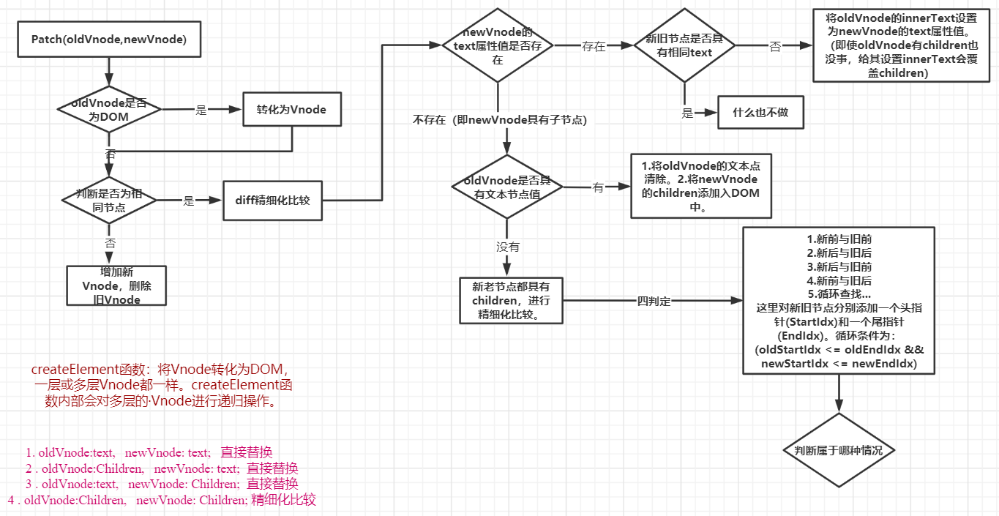

title: diff算法的Patch函数
author: xujintai
tags:
  - Vue
  - ''
categories:
  - Vue2源码
date: 2021-05-26 13:44:00
---
#### diff算法的Patch函数👍

##### 🦄 patch（oldVnode，newVnode）
###### 1.判断oldVnode是否为DOM，若是DOM则转化为Vnode。

###### 2.比较oldVnode与newVnode是否为相同节点。
1. 若不是相同节点，则添加newVnode、删除oldVnode（注意添删顺序）。

   1. 当**newVnode没有Children、或者Children长度为0**时，createElement函数将创建的DOM填充text然后返回创建DOM。
   2. 当**newVnode有Children属性并且长度不为0**时，createElement函数遍历newVnode的**children属性中的Vnode**，将这些Vnode依次createElement递归，并将返回结果使用创建的DOM进行appendChild，最后返回这个DOM元素。
   3. createElement函数创建返回DOM在Patch函数中进行insertBefore。**注意：一旦调用了 createElement(newVnode)就意味着生成了新的DOM元素，并且newVnode的elm属性指向这个DOM元素。**
     

2. 若是相同节点：



###### 当新旧节点都具有Children(子节点)时，进行精细化比较：updateChildren(旧节点DOM,旧节点,新节点)，具体逻辑代码实现如下所示：
```
export default function updateChildren(parentElm, oldCh, newCh) {
    //parentElm:旧节点DOM, oldCh：旧节点, newCh：新节点
    console.log(oldCh, newCh);

    // 旧节点前指针
    let oldStartIdx = 0;
    // 新节点前指针
    let newStartIdx = 0;
    // 旧节点后指针
    let oldEndIdx = oldCh.length - 1;
    // 新节点后指针
    let newEndIdx = newCh.length - 1;
    // 旧前节点(旧节点前指针所指向节点)
    let oldStartVnode = oldCh[0];
    // 旧后节点
    let oldEndVnode = oldCh[oldEndIdx];
    // 新前节点
    let newStartVnode = newCh[0];
    // 新后节点
    let newEndVnode = newCh[newEndIdx];

    let keyMap = null;

    // 开始while循环
    while (oldStartIdx <= oldEndIdx && newStartIdx <= newEndIdx) {
        // 首先不是判断①②③④命中，而是要略过已经加undefined标记的东西
        if (oldStartVnode == null || oldCh[oldStartIdx] == undefined) {
            oldStartVnode = oldCh[++oldStartIdx];
        } else if (oldEndVnode == null || oldCh[oldEndIdx] == undefined) {
            oldEndVnode = oldCh[--oldEndIdx];
        } else if (newStartVnode == null || newCh[newStartIdx] == undefined) {
            newStartVnode = newCh[++newStartIdx];
        } else if (newEndVnode == null || newCh[newEndIdx] == undefined) {
            newEndVnode = newCh[--newEndIdx];
        } else if (checkSameVnode(oldStartVnode, newStartVnode)) {
            // 新前和旧前
            console.log('①新前和旧前命中');
            patchVnode(oldStartVnode, newStartVnode);//patchVnode：将新节点的变化体现到旧节点
            oldStartVnode = oldCh[++oldStartIdx];
            newStartVnode = newCh[++newStartIdx];
        } else if (checkSameVnode(oldEndVnode, newEndVnode)) {
            // 新后和旧后
            console.log('②新后和旧后命中');
            patchVnode(oldEndVnode, newEndVnode);
            oldEndVnode = oldCh[--oldEndIdx];
            newEndVnode = newCh[--newEndIdx];
        } else if (checkSameVnode(oldStartVnode, newEndVnode)) {
            // 新后和旧前
            console.log('③新后和旧前命中');
            patchVnode(oldStartVnode, newEndVnode);
            // 当③新后与旧前命中的时候，此时要移动节点。移动新前指向的这个节点到老节点的旧后的后面
            // 如何移动节点？？只要你插入一个已经在DOM树上的节点，它就会被移动
            parentElm.insertBefore(oldStartVnode.elm, oldEndVnode.elm.nextSibling);
            oldStartVnode = oldCh[++oldStartIdx];
            newEndVnode = newCh[--newEndIdx];
        } else if (checkSameVnode(oldEndVnode, newStartVnode)) {
            // 新前和旧后
            console.log('④新前和旧后命中');
            patchVnode(oldEndVnode, newStartVnode);
            // 当④新前和旧后命中的时候，此时要移动节点。移动旧后当前指向的这个节点到旧前的前面
            parentElm.insertBefore(oldEndVnode.elm, oldStartVnode.elm);
            // 如何移动节点？？只要你插入一个已经在DOM树上的节点，它就会被移动
            oldEndVnode = oldCh[--oldEndIdx];
            newStartVnode = newCh[++newStartIdx];
        } else {
            // 四种命中都没有命中
            // 制作keyMap一个映射对象，这样就不用每次都遍历老对象了。
            if (!keyMap) {
                keyMap = {};
                // 从oldStartIdx开始，到oldEndIdx结束，创建keyMap映射对象：映射旧节点的所有key值
                for (let i = oldStartIdx; i <= oldEndIdx; i++) {
                    const key = oldCh[i].key;
                    if (key != undefined) {
                        keyMap[key] = i;
                    }
                }
            }
            console.log(keyMap);
            // 寻找当前这项（newStartIdx）在keyMap中的映射的位置序号
            const idxInOld = keyMap[newStartVnode.key];
            console.log(idxInOld);
            if (idxInOld == undefined) {
                // 判断，如果idxInOld是undefined表示它是全新的项
                // 被加入的项（就是newStartVnode这项)现不是真正的DOM节点
                parentElm.insertBefore(createElement(newStartVnode), oldStartVnode.elm);
            } else {
                // 如果不是undefined，不是全新的项，而是要移动
                const elmToMove = oldCh[idxInOld];
                patchVnode(elmToMove, newStartVnode);
                // 把这项设置为undefined，表示我已经处理完这项了
                oldCh[idxInOld] = undefined;
                // 移动，调用insertBefore也可以实现移动。
                parentElm.insertBefore(elmToMove.elm, oldStartVnode.elm);
            }
            // 指针下移，只移动新的头
            newStartVnode = newCh[++newStartIdx];
        }
    }

    // 继续看看有没有剩余的。循环结束了start还是比old小
    if (newStartIdx <= newEndIdx) {
        console.log('new还有剩余节点没有处理，要加项。要把所有剩余的节点，都要插入到oldStartIdx之前');
        // 遍历新的newCh，添加到老的没有处理的之前
        for (let i = newStartIdx; i <= newEndIdx; i++) {
            // insertBefore方法可以自动识别null，如果是null就会自动排到队尾去。和appendChild是一致了。
            // newCh[i]现在还没有真正的DOM，所以要调用createElement()函数变为DOM
            parentElm.insertBefore(createElement(newCh[i]), oldCh[oldStartIdx].elm);
        }
    } else if (oldStartIdx <= oldEndIdx) {
        console.log('old还有剩余节点没有处理，要删除项');
        // 批量删除oldStart和oldEnd指针之间的项
        for (let i = oldStartIdx; i <= oldEndIdx; i++) {
            if (oldCh[i]) {
                parentElm.removeChild(oldCh[i].elm);
            }
        }
    }
};

```
##### 意义
###### Diff算法实现最小化更新。不仅仅在Vue中，包括git中的文件管理也用到了Diff算法。在Vue中，若对应的新旧节点为相同元素且key值相同时，diff算法会进行复用旧节点。数据更新时:仅更新元素的值、增删元素时在旧节点基础上进行DOM元素的增删操作。